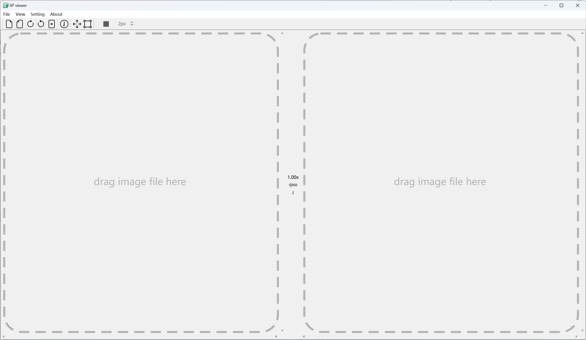
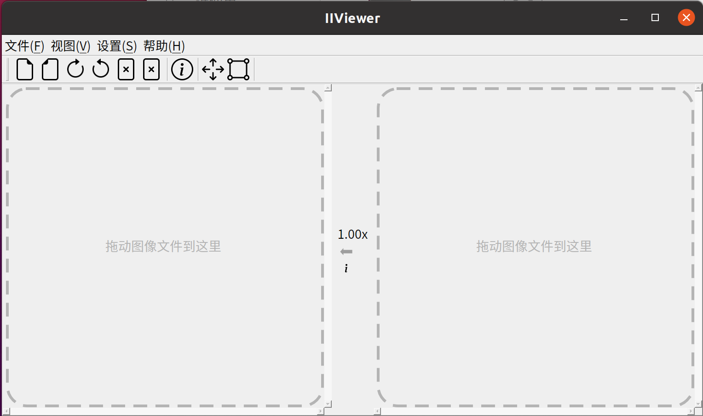

<h1 align="center">IIViewer</h1>
<p align="center">
    <strong>A thoughtful tool which designed for image signal process developer</strong>
</p>
<p align="center">
    
</p>

<p align="center">
    
    
    
</p>

## About
this repo is designed for open and view ISP intermediate image. we support these format below:
- jpg
- bmp
- png
- tiff
- pgm(8/10/12/14/16 bit)
- pnm(8/10/12/14/16 bit)
- raw(8/10/12/14/16/18/20/22/24 bit)
- mipi-raw(10/12/14 bit)
- rgbir-raw(8/10/12/14/16/18/20/22/24 bit)
- yuv(8/10/12 444-interleave4 444-plannar 422-UYVY 422-YUYV 420-NV12 420-NV21 420P-YU12 420P-YV12 400)
- heif(.heic 8bit yuv420)

## Usage
download it from [release page](https://github.com/JonahZeng/IIViewer/releases)(we provide precompiled x64 exe and deb file), start this app on your PC, you can see this if no unexpect error occurred:





as its tips, drag any supported format image to dash rectangle，it will display the image context. when you zoom in to 96X by scroll your mouse wheel, you will see every pixel's real value.
that's all.

## Build from source code
### windows(AMD64)
#### prepare
1. install cmake(>=3.20)
2. install MSVC or MinGW64 (should support **C++17 at least**)
3. build and install OpenSSL, here is offical [repo](https://github.com/openssl/openssl) and build [guide](https://github.com/openssl/openssl/blob/master/NOTES-WINDOWS.md), once you build and install it successed, copy its install dir to this git repo **thirdparty** directory. 
4. build libde265
    ```bash
    wget https://github.com/strukturag/libde265/releases/download/v1.0.16/libde265-1.0.16.tar.gz
    tar -zxf libde265-1.0.16.tar.gz
    cd libde265-1.0.16
    mkdir build
    cd build
    cmake .. -G "Visual Studio 17 2022" -A x64 \
        -DENABLE_DECODER=OFF \
        -DENABLE_ENCODER=OFF \
        -DENABLE_SDL=OFF \
        -DBUILD_SHARED_LIBS=ON
    cmake --build . --config Release -j 4
    cmake --install . --prefix=${you_libde265_install_path} --config Release
    ```
5. build libheif
    ```bash
    wget https://github.com/strukturag/libheif/releases/download/v1.21.2/libheif-1.21.2.tar.gz
    tar -zxf libheif-1.21.2.tar.gz
    cd libheif-1.21.2
    mkdir build
    cd build
    cmake .. -G "Visual Studio 17 2022" -A x64 \
        -DWITH_LIBDE265=ON \
        -DWITH_X265=OFF \
        -DWITH_KVAZAAR=OFF \
        -DWITH_UVG266=OFF \
        -DWITH_VVDEC=OFF \
        -DWITH_VVENC=OFF \
        -DWITH_X264=OFF \
        -DWITH_OpenH264_ENCODER=OFF \
        -DWITH_OpenH264_DECODER=OFF \
        -DWITH_DAV1D=OFF \
        -DWITH_AOM_ENCODER=OFF \
        -DWITH_AOM_DECODER=OFF \
        -DWITH_SvtEnc=OFF \
        -DWITH_RAV1E=OFF \
        -DWITH_JPEG_ENCODER=OFF \
        -DWITH_JPEG_DECODER=OFF \
        -DWITH_OpenJPEG_ENCODER=OFF \
        -DWITH_OpenJPEG_DECODER=OFF \
        -DWITH_FFMPEG_DECODER=OFF \
        -DWITH_OPENJPH_ENCODER=OFF \
        -DWITH_OPENJPH_DECODER=OFF \
        -DWITH_UNCOMPRESSED_CODEC=OFF \
        -DWITH_WEBCODECS=OFF \
        -DWITH_LIBSHARPYUV=OFF \
        -DWITH_EXAMPLES=OFF \
        -DWITH_EXAMPLE_HEIF_THUMB=OFF \
        -DWITH_EXAMPLE_HEIF_VIEW=OFF \
        -DWITH_GDK_PIXBUF=OFF \
        -DBUILD_DOCUMENTATION=OFF \
        -DBUILD_TESTING=OFF \
        -DBUILD_SHARED_LIBS=ON \
        -DLIBDE265_INCLUDE_DIR="${you_libde265_install_path}\\include" \
        -DLIBDE265_LIBRARY="${you_libde265_install_path}\\lib\\de265.lib"
    cmake --build . --config Release -j 4
    cmake --install . --prefix=${you_install_path} --config Release
    ```

6. install Qt5 with necessary module:
    - Widgets
    - Gui
    - Core 
    - DataVisualization
    - Network(**enable ssl**)

if you install Qt by build from soure, here is my configuration(MinGW64 13.2.0, Qt5.15.15) for reference:
```bash
.\configure -prefix {qt_source\qtbase} \
-opensource -confirm-license \
-openssl-runtime \
-I {openssl3 header direcotry} \
-L {openssl3 library directory} \
-nomake tests \
-nomake examples \
-opengl desktop \
-release \
-skip webview \
-skip webengine \
-skip webglplugin \
-skip webchannel 
```
MSVC build Qt5.15.16:
```bat
configure -prefix \
%CD%\qtbase \
-opensource \
-confirm-license \
-nomake tests \
-nomake examples \
-release \
-skip webview \
-skip webengine \
-skip webglplugin \
-skip webchannel \
-openssl-runtime \
-I {openssl3 header direcotry} \
-L {openssl3 library directory} \
-make-tool jom \
-platform win32-msvc
```
#### build
I have test it both on windows10 with mingw64 13.2.0 and windows11 with MSVC v143, Qt version >= 5.15.2.
follow these steps:
```bat
git clone https://github.com/JonahZeng/IIViewer.git
cd IIViewer
mkdir build
cd build
cmake .. -DCMAKE_PREFIX_PATH=YOUR_QT_INSTALL_DIR
cmake --build . --config Release
```

### linux(amd64 & arm64)
#### prepare
install gcc, openssl and Qt5 on ubuntu 22.04
```bash
sudo apt install build-essential libssl-dev qtbase5-dev libqt5datavisualization5-dev qtbase5-dev-tools libqt5charts5-dev qttools5-dev-tools qttools5-dev
```
install cmake by download from [newest release ](https://github.com/Kitware/CMake/releases) or build from source.
#### build
these build steps had been tested on ubuntu 22.04(cmake 3.31, Qt5.15.3, gcc 11.4.0)
```bash
git clone https://github.com/JonahZeng/IIViewer.git
cd IIViewer
mkdir build
cd build
cmake .. -DCMAKE_BUILD_TYPE=Release
cmake --build . -j 4
```
#### pack to Deb or AppImage
for deb:
```bash
cpack -G DEB -C Release
```
for AppImage, you should download [linuxdeployqt](https://github.com/probonopd/linuxdeployqt/releases) first, and then prepare a .desktop and a icon file. a default icon and desktop file are placed in `icon` directory, you can simplely copy them to bin directory and execute linuxdeployqt:
```bash
cp ./icon/default.png ./bin/Release/ 
cp ./icon/default.desktop ./bin/Release/ 
wget https://github.com/probonopd/linuxdeployqt/releases/download/continuous/linuxdeployqt-continuous-x86_64.AppImage
chmod a+x ./linuxdeployqt-continuous-x86_64.AppImage
./linuxdeployqt-continuous-x86_64.AppImage ./bin/Release/IIViewer -verbose=2 -bundle-non-qt-libs -appimage
```

### macos(arm64)
Use homebrew to install Qt5 on mac
```bash
/bin/bash -c "$(curl -fsSL https://raw.githubusercontent.com/Homebrew/install/HEAD/install.sh)"
brew install qt@5
git clone https://github.com/JonahZeng/IIViewer.git
cd IIViewer
cmake -B ./build -S . -DCMAKE_BUILD_TYPE=Release -DCMAKE_INSTALL_PREFIX=./build/install -DCMAKE_PREFIX_PATH=/opt/homebrew/opt/qt@5 -DLRELEASE_EXECUTABLE=/opt/homebrew/opt/qt@5/bin/lrelease -DEXTRA_QT_INCLUDE_DIRS=/opt/homebrew/opt/qt@5/include
cmake --build . -j 4
```

## Translation
- use `lupdate` to scan all the source codes and generate a .ts file
- use `linguist` to translate the .ts file, and public it to a .qm file
- load specific .qm file when the software startup, based on the user's region and language
```bash
lupdate.exe ./src/Main.cpp ./src/IIPviewer.cpp ./src/IIPviewerLrImgProcess.cpp ./inc/IIPviewer.h ./src/AboutDlg.cpp ./inc/AboutDlg.h ./src/ImageWidget.cpp ./src/ImageWidgetRoiShowText.cpp ./inc/ImageWidget.h ./src/RawFileInfoDlg.cpp ./inc/RawFileInfoDlg.h ./inc/RawFileInfoDlg.ui ./inc/IIPOptionDialog.h ./inc/IIPOptionDialog.ui ./src/IIPOptionDialog.cpp ./src/IIPviewer_ui.cpp ./inc/IIPviewer_ui.h ./src/YuvFileInfoDlg.cpp ./inc/YuvFileInfoDlg.h ./inc/YuvFileInfoDlg.ui ./src/DataVisualDlg.cpp ./inc/DataVisualDlg.h ./inc/AppSetting.h ./src/AppSetting.cpp ./inc/RoiDataShowDlg.h ./src/RoiDataShowDlg.cpp ./inc/ImgInfoDlg.h ./src/ImgInfoDlg.cpp ./inc/ImgDiffReportDlg.h ./src/ImgDiffReportDlg.cpp ./inc/CurveAdjustDialog.h ./src/CurveAdjustDialog.cpp ./inc/ColorSpaceCvt.h ./src/ColorSpaceCvt.cpp ./inc/common_type.h -ts ./translations/IIViewer_zh.ts
```

## HiDPI font render on windows
if you use 4k monitor and enable high dpi, you will see alise around the font. Fortunately, we have a simple solution:
create a environment variable named `QT_QPA_PLATFORM`, set the value to `windows:fontengine=freetype`, restart the application.

## Sponsor
WeChat Pay:


