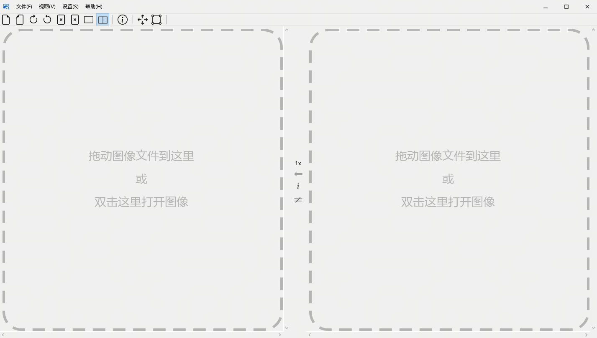
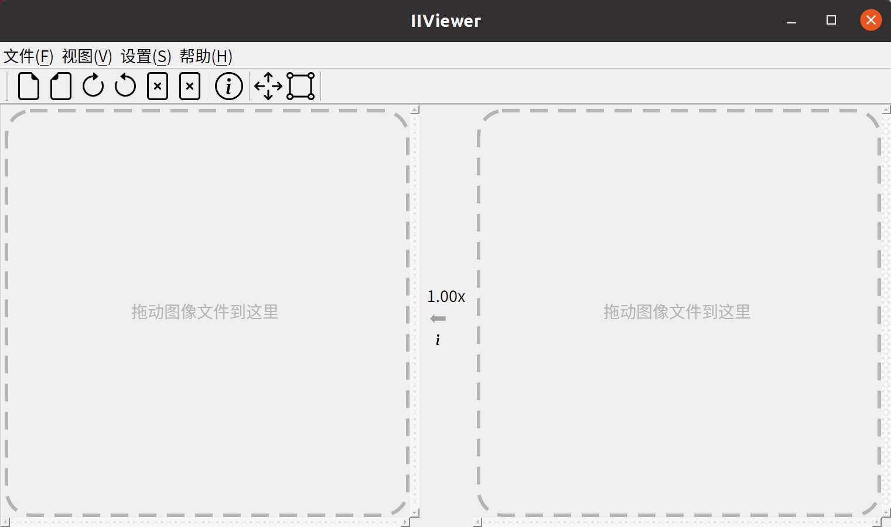
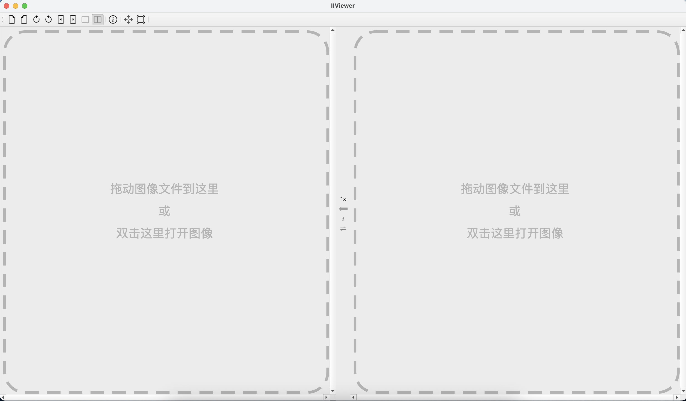

<h1 align="center">IIViewer</h1>

    <strong>A thoughtful tool which designed for image signal process developer</strong>

    

    
    
    

## About

This repo is designed for open and view ISP intermediate image. We support these formats:

- jpg / bmp / png / tiff
- pgm (8/10/12/14/16 bit)
- pnm (8/10/12/14/16 bit)
- raw (8/10/12/14/16/18/20/22/24 bit)
- mipi-raw (10/12/14 bit)
- rgbir-raw (8/10/12/14/16/18/20/22/24 bit)
- yuv (8/10/12, 444-interleave/444-planar/422-UYVY/422-YUYV/420-NV12/420-NV21/420P-YU12/420P-YV12/400)
- heif (.heic 8bit yuv420/422/444)

## Usage

Download from the [release page](https://github.com/JonahZeng/IIViewer/releases) (we provide precompiled x64 exe, deb, and dmg). Start the app and drag any supported image file onto the window:

Drag any supported format image to the dash rectangle, and it will display the image content. Zoom in to 96x by scrolling your mouse wheel to see every pixel's real value.

> **Qt5 users**: The `qt5` branch contains the last Qt5-compatible version. Check the [qt5 branch](https://github.com/JonahZeng/IIViewer/tree/qt5) and [qt5 release](https://github.com/JonahZeng/IIViewer/releases/tag/v0.6.8)if you can't migrate.

## Building

See [CONTRIBUTING.md](CONTRIBUTING.md) for build instructions and development setup.

## HiDPI font render on Windows

If you use a 4K monitor with high DPI, you may see aliasing around text. To fix this, set the environment variable `QT_QPA_PLATFORM` to `windows:fontengine=freetype` and restart the application.

## Sponsor

WeChat Pay:

