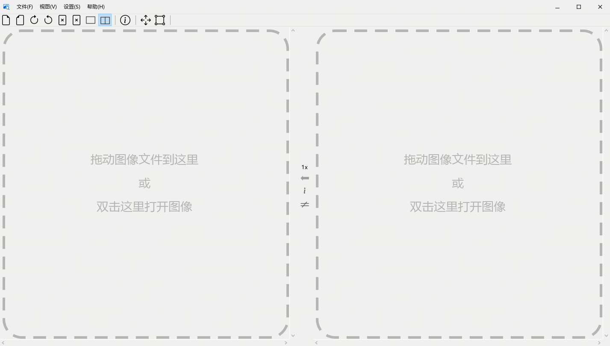
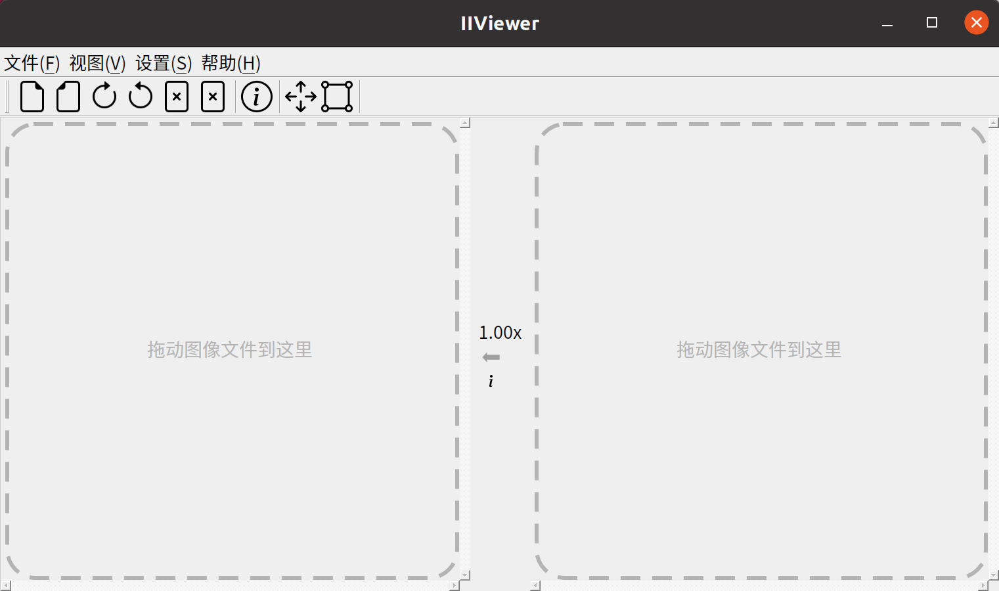
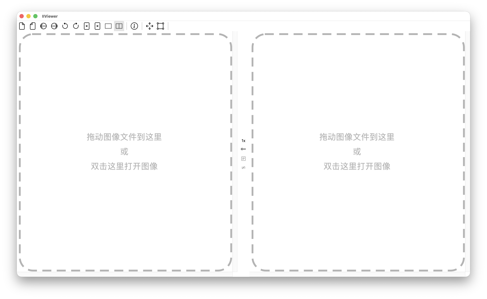

<h1 align="center">IIViewer</h1>

    <strong>一款为图像信号处理（ISP）开发者设计的贴心工具</strong>

    

    
    
    
    
    

    <a href="./README.md">English</a> | 简体中文

## 简介

本图像查看器用于打开、查看和对比 ISP 中间图像，支持以下格式：

|格式|详情|
|:--:|:--:|
|jpg/bmp/png/tiff|仅支持 baseline jpg，8bit|
|pgm|8/10/12/14/16 bit|
|pnm|8/10/12/14/16 bit|
|raw|8/10/12/14/16/18/20/22/24 bit|
|mipi-raw|10/12/14 bit|
|rgbir-raw|8/10/12/14/16/18/20/22/24 bit|
|dng|(CFA Bayer + 未压缩) 由 DJI pocket 4 拍摄，(LinearRaw + LossJPEG 压缩) 由 iPhone 13 pro 拍摄|
|yuv|8/10/12，444-交织/444-平面/422-UYVY/422-YUYV/420-NV12/420-NV21/420P-YU12/420P-YV12/400|
|heif|yuv420/422/444 8bit|

## 使用方法

预编译的二进制文件可在 [release 页面](https://github.com/JonahZeng/IIViewer/releases) 下载：

|系统|架构|安装包|
|:--:|:--:|:--|
|Windows 10/11|x86_64|`.exe` 安装程序、`.msi`、绿色版 `.zip`|
|Ubuntu 22.04+|x86_64|`.deb`、`.AppImage`（附带用于增量更新的 `.zsync`）|
|Ubuntu 24.04+|arm64|`.deb`、`.AppImage`（附带用于增量更新的 `.zsync`）|
|macOS|arm64（Apple Silicon）|`.dmg`|

对于 Windows 10/11 用户，winget 是最便捷的安装方式，只需运行命令 `winget install JonahZeng.IIViewer`。

启动应用后，将任意支持的图像文件拖拽到窗口中即可：

将任意支持格式的图像拖拽到虚线矩形区域，即可显示图像内容。滚动鼠标滚轮将图像放大至 96 倍，即可查看每个像素的真实数值。

> **Qt5 用户**：`qt5` 分支保留了最后一个兼容 Qt5 的版本。如果无法迁移，请查看 [qt5 分支](https://github.com/JonahZeng/IIViewer/tree/qt5) 和 [qt5 release](https://github.com/JonahZeng/IIViewer/releases/tag/v0.6.8)。

## 构建

构建说明和开发环境搭建请参阅 [CONTRIBUTING.md](CONTRIBUTING.md)。

## Windows 上的 HiDPI 字体渲染

如果在高 DPI 的 4K 显示器上看到文字边缘有锯齿，可将环境变量 `QT_QPA_PLATFORM` 设置为 `windows:fontengine=freetype` 并重启应用即可解决。

## 赞助

微信支付：

